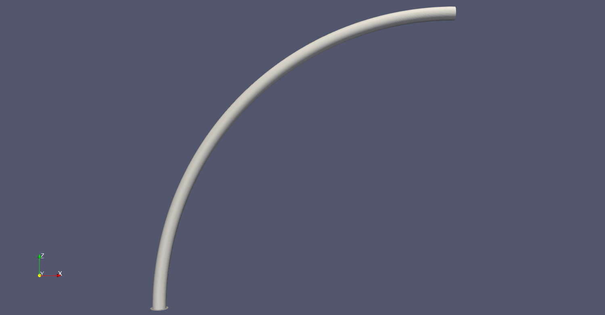
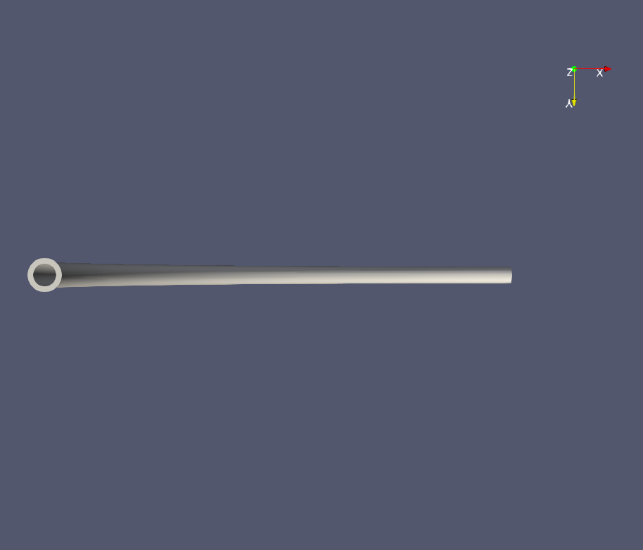
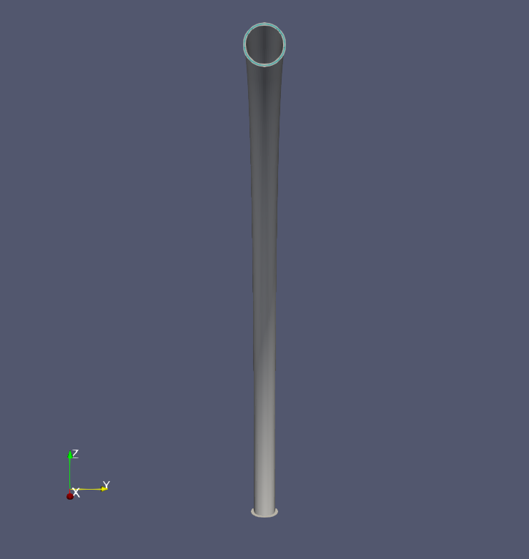
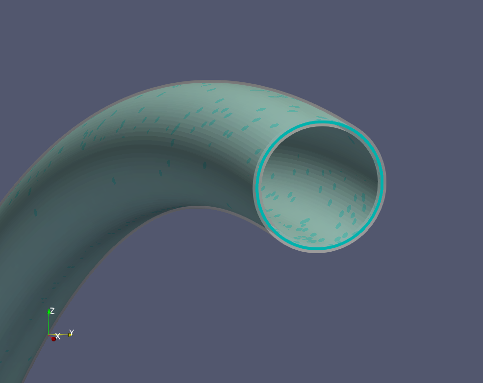
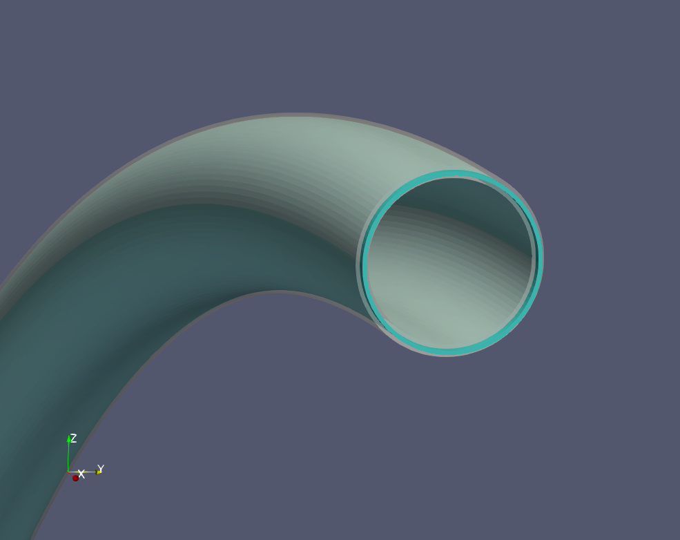
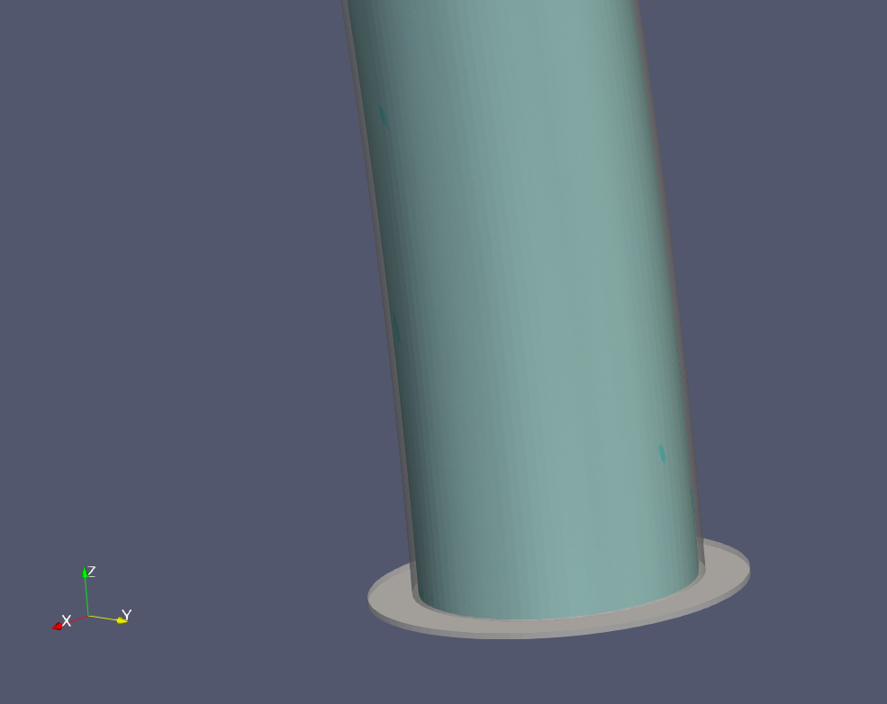
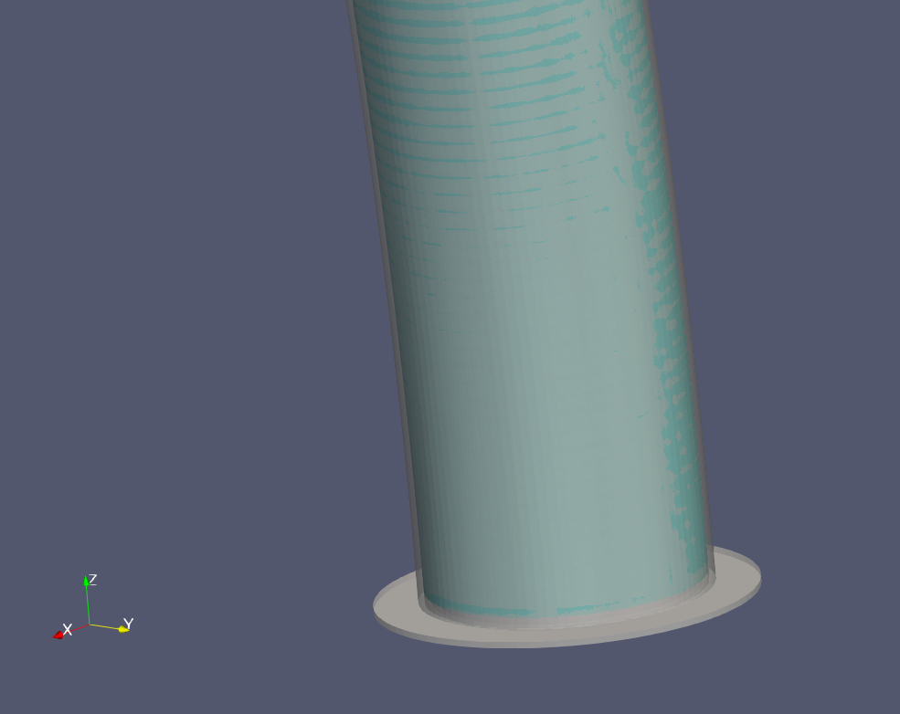

# DoubleTubeContact
円弧状の二重管の隙間に詰められた膜を引き抜く、有限滑り接触を用いた非線形動解析問題。

## 解析条件の概要
円弧状の二重管の下側には、結合接触でリング状の足が取りつけられている。同二重管の上側は開放されている。二重管の間には隙間を埋める形で膜が挟まれており、管と膜の接触面には有限滑り接触が設定されている。二重管の足の裏は完全固定となっている。

 
図1 側面から見た二重管

 
図2 下側から見た二重管(左側のリングは足)

 
図3 正面から見た二重管(上側開放部の水色部分は二重管に挟まれた膜)

さらに上側開放部に露出した膜の断面に強制速度を設定して膜を引っ張り出す。図4の左側は初期状態、右側は変形後の膜が引っ張り出された様子を表している。

 
図4 二重管上側解法部の拡大図(管は白色半透明、膜は水色で着色されている。部分は二重管に挟まれた膜)

図5の左側は初期状態、右側は変形後の膜が引っ張り上げられた様子を表している。

 
図5 二重管足部分の拡大図(管は白色半透明、膜は水色で着色されている。部分は二重管に挟まれた膜)
